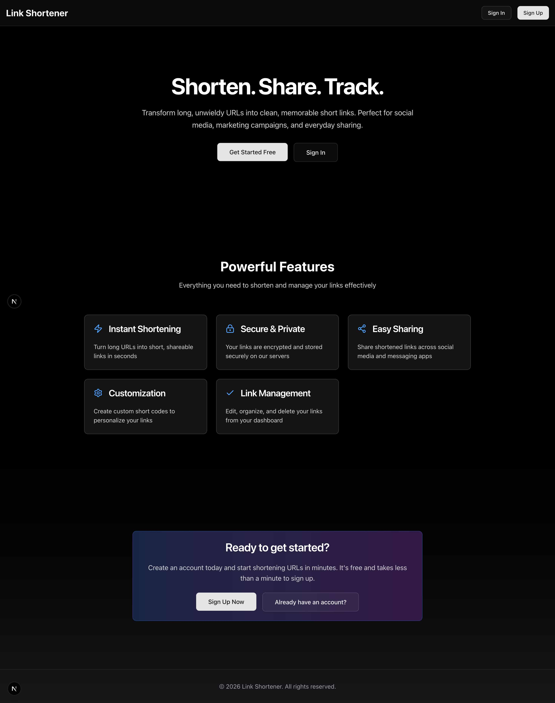
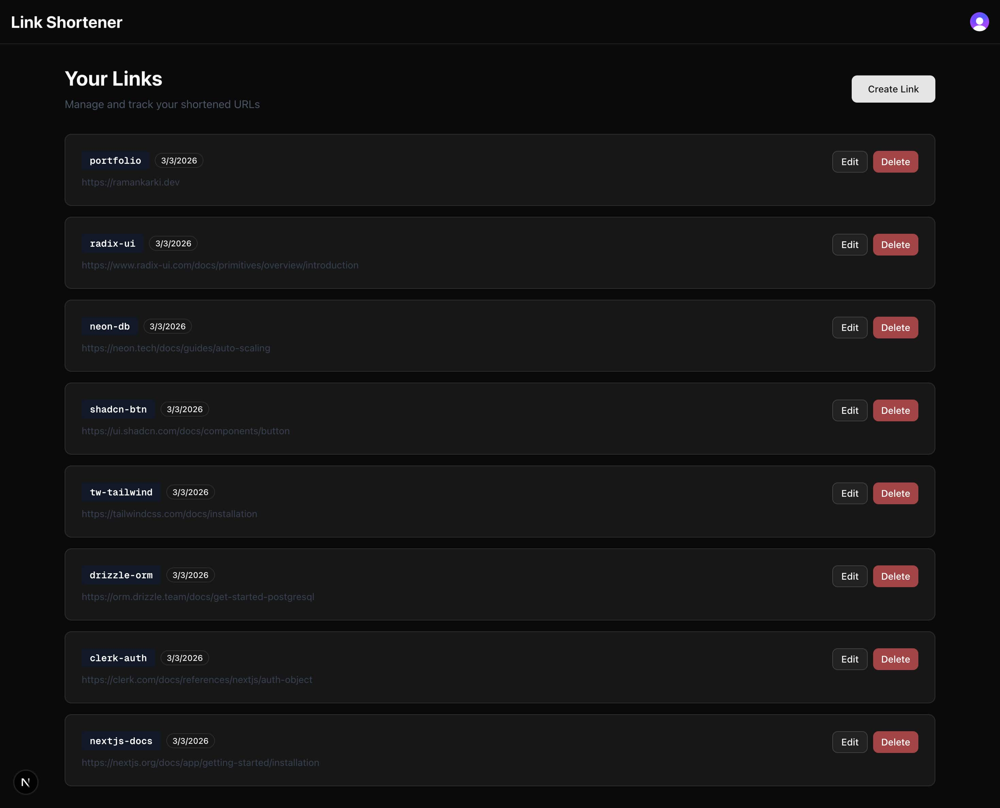
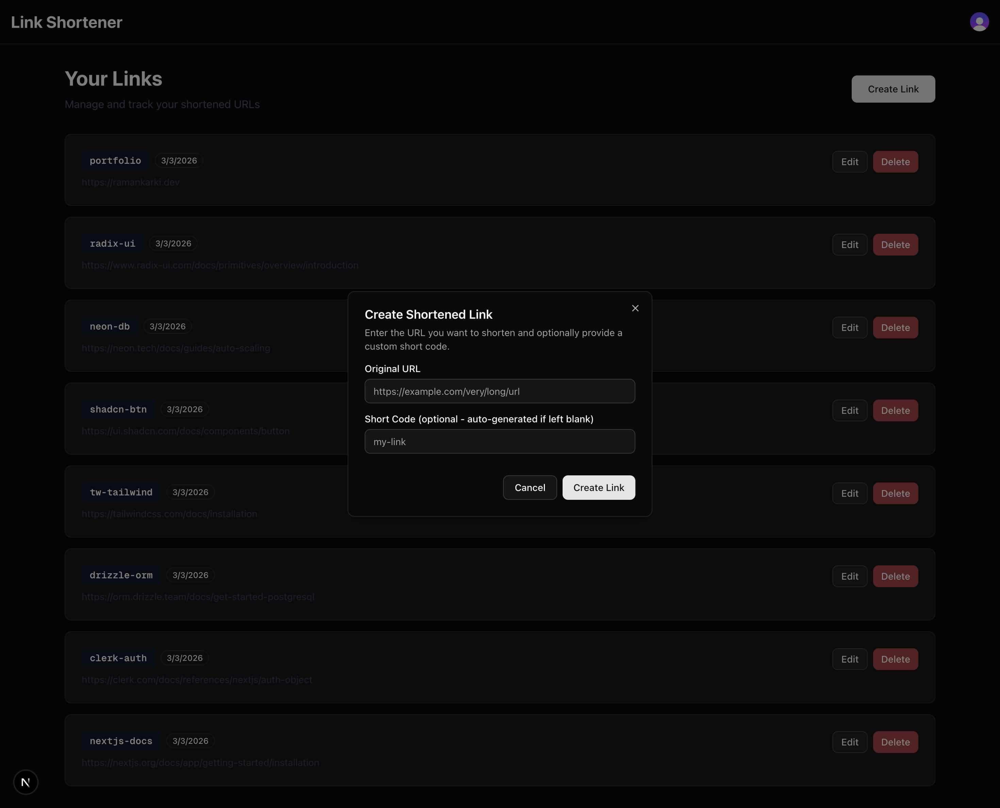

# Link Shortener 🔗

A modern URL shortening service built entirely with **GitHub Copilot**. My **first test project** to explore and master Copilot's advanced features including **agents**, **instructions**, **prompts**, **skills**, and **sub-agents**.

## ⚡ Project Purpose

This project serves as a learning ground for understanding:

- **Agents** - Autonomous task orchestration
- **Instructions** - Custom behavior guidelines for Copilot
- **Prompts** - Effective prompt engineering patterns
- **Skills** - Custom capabilities and workflows
- **Sub-agents** - Task delegation and parallel processing

Built with Copilot's assistance to demonstrate how AI-driven development accelerates building full-stack applications.

## 🎯 Features

- **URL Shortening**: Create short, memorable codes for long URLs
- **User Authentication**: Secure login via Clerk
- **Dashboard**: View, edit, and manage all shortened links
- **Link Management**: Edit existing links and delete ones no longer needed
- **User-Specific Links**: Each user sees only their own shortened URLs
- **Responsive Design**: Works seamlessly on desktop and mobile

## 🛠️ Tech Stack

| Layer               | Technology                             |
| ------------------- | -------------------------------------- |
| **Framework**       | Next.js 16.1.6 (App Router)            |
| **Language**        | TypeScript (strict mode)               |
| **Database**        | PostgreSQL (Neon) + Drizzle ORM 0.45.1 |
| **Authentication**  | Clerk v6.39.0                          |
| **Styling**         | Tailwind CSS 4 + Shadcn/UI             |
| **Components**      | React 19 + Radix UI                    |
| **Package Manager** | pnpm                                   |

## 🚀 Getting Started

### Prerequisites

- Node.js 18+ and pnpm
- Clerk API keys ([get them here](https://clerk.com))
- Neon PostgreSQL database ([create one here](https://neon.tech))

### Installation

1. Clone the repository:

```bash
git clone <repository-url>
cd link-shortner
```

2. Install dependencies:

```bash
pnpm install
```

3. Set up environment variables:

```bash
# Create .env.local with:
DATABASE_URL=your_neon_connection_string
CLERK_PUBLISHABLE_KEY=your_clerk_key
CLERK_SECRET_KEY=your_clerk_secret
```

4. Generate and push database schema:

```bash
npx drizzle-kit generate
npx drizzle-kit push
```

5. Start the development server:

```bash
pnpm dev
```

Open [http://localhost:3000](http://localhost:3000) in your browser.

## 📁 Project Structure

```
app/                          # Next.js App Router
├── page.tsx                 # Landing page
├── layout.tsx               # Root layout with providers
├── globals.css              # Global styles
├── components/
│   ├── header.tsx          # Navigation header
│   └── auth-redirect.tsx    # Auth-based routing
├── dashboard/              # User dashboard
│   ├── page.tsx            # Dashboard page
│   ├── dashboard-content.tsx # Content component
│   ├── create-link-modal.tsx # Create link form
│   ├── edit-link-modal.tsx   # Edit link form
│   ├── delete-link-dialog.tsx # Delete confirmation
│   └── actions.ts          # Server actions
└── l/[shortcode]/
    └── route.ts            # URL redirect endpoint

db/                          # Database layer
├── index.ts                # Drizzle ORM instance
└── schema.ts               # Database schema

lib/
├── utils.ts                # Shared utilities (cn() for Tailwind)

components/ui/              # Reusable UI components
├── button.tsx
├── card.tsx
├── dialog.tsx
├── input.tsx
└── ...

.github/instructions/       # Copilot instruction files
├── auth.instructions.md
├── data-fetching.instructions.md
├── server-actions.instructions.md
└── ui-components.instructions.md
```

## 🔑 Key Commands

```bash
# Development
pnpm dev              # Start dev server (hot reload)
pnpm build            # Build for production
pnpm start            # Start production server
pnpm lint             # Run ESLint

# Database
npx drizzle-kit generate  # Generate schema migrations
npx drizzle-kit push      # Push schema changes to database
```

## 📸 Screenshots

### Landing Page



### Dashboard



### Create Link Modal



## 🤖 Built with GitHub Copilot

This entire project was developed using GitHub Copilot with custom:

- **Agents** for code generation and testing
- **Instructions** for consistent code patterns
- **Prompts** for specific feature implementations
- **Skills** for domain-specific tasks
- **Sub-agents** for parallel task execution

The project demonstrates how Copilot's advanced features can accelerate full-stack development while maintaining code quality and best practices.

## 📚 Learning Resources

- [GitHub Copilot Documentation](https://docs.github.com/en/copilot)
- [Next.js Documentation](https://nextjs.org/docs)
- [Clerk Documentation](https://clerk.com/docs)
- [Drizzle ORM Docs](https://orm.drizzle.team)
- [Tailwind CSS](https://tailwindcss.com)

## 🧪 Development Notes

- **Strict TypeScript**: All code uses strict mode - types must be explicit
- **Server Components First**: Use server components by default; only add `'use client'` when needed
- **Shadcn/UI**: Leverage pre-built components for consistency
- **Drizzle ORM**: Database queries are type-safe and automated

## 📝 License

MIT

---

**Built with ❤️ using GitHub Copilot** - Demonstrating the power of AI-assisted development.
